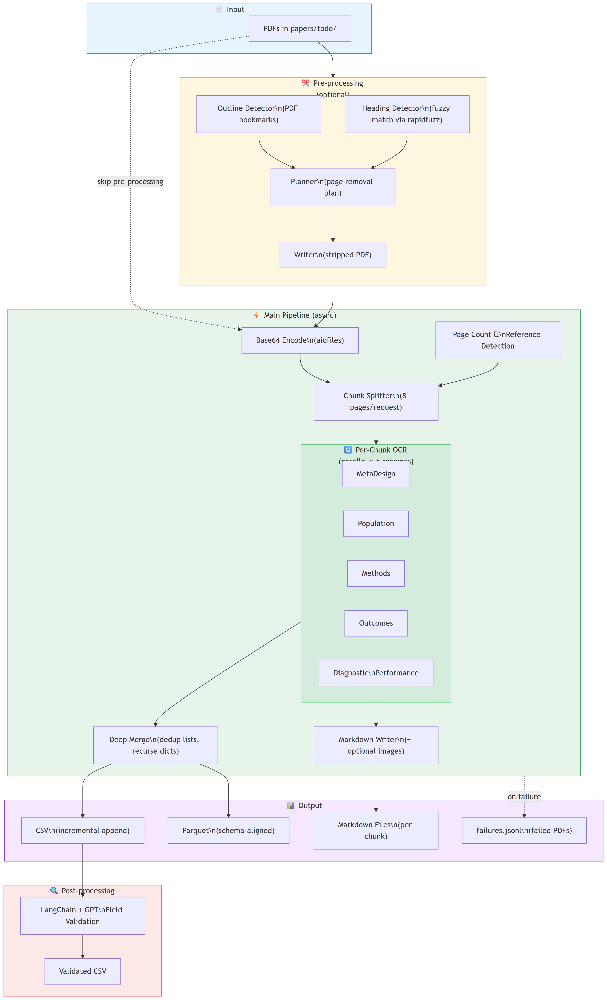
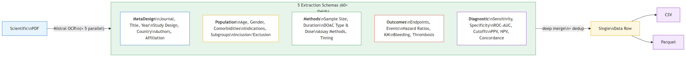

# Mistral OCR Annotation Pipeline

[](https://www.python.org/)
[](#license)
[](#testing)

A **high-throughput, asynchronous** pipeline for **OCR-driven structured data extraction** from scientific PDFs using **Mistral OCR**. Built for biomedical literature — extracts study design, patient populations, methods, clinical outcomes, and diagnostic performance metrics into **CSV/Parquet** tables.

## Pipeline Architecture

<p align="center">
  
</p>

## Extraction Schemas

The pipeline runs **5 Pydantic schemas in parallel** per PDF chunk, each targeting a different clinical domain. Results are deep-merged into a single row per paper.

<p align="center">
  
</p>

Each of the 60+ fields includes a paired `_sentence_from_text` field for traceability. Adding a new field to any schema automatically propagates to CSV/Parquet output columns.

---

## Highlights

- **Async batching** with configurable concurrency and rate limiting
- **Schema-driven extraction** — 5 Pydantic V2 models (60+ fields) define both the Mistral API contract and output columns
- **PDF pre-processing** — strip intro, background, acknowledgments, and references before OCR
- **Chunking + deep merge** — large PDFs split into 8-page chunks, results merged with list dedup and nested dict recursion
- **Resume mode** — SHA256-tracked; skip already-processed PDFs
- **Failure tracking** — failed PDFs logged to `failures.jsonl`
- **Retry with backoff** — retries on 429, 500, 502, 503, 504, and timeout errors (5 attempts, exponential backoff)
- **Post-processing validation** — LLM-based field verification via LangChain + GPT
- **Incremental I/O** — rows append to CSV/Parquet one at a time (no in-memory accumulation)
- **Markdown reports** with optional base64-inlined image annotations

---

## Setup

### 1. Clone

```bash
git clone https://github.com/pouriamrt/mistral-ocr-pipeline.git
cd mistral-ocr-pipeline
```

### 2. Install Dependencies

**Requires Python 3.13+**

```bash
# Recommended (includes dev tools)
uv sync --all-groups

# Or just runtime deps
uv sync

# Or using pip
python -m venv .venv && source .venv/bin/activate  # Windows: .venv\Scripts\activate
pip install -e .
```

### 3. Environment

Create a `.env` file with your API keys:

```ini
MISTRAL_API_KEY=your_api_key_here
MAX_CONCURRENCY=3           # concurrent OCR tasks
IMAGE_ANNOTATION=False      # base64 inline images in markdown
OVERWRITE_MD=True           # reprocess all PDFs (False = resume mode)
OCR_RPS=5                   # OCR requests per second rate limit
MODEL_JUDGE=gpt-4o-mini     # LLM for post-processing validation (optional)
INPUT_DIR=papers/todo       # PDF input directory
```

### 4. Input PDFs

Place PDF files in `./papers/todo/`. The pipeline scans `*.pdf` automatically.

---

## Quickstart

```bash
# Optional: strip unwanted sections first
python pre_processing/main.py

# Run the main extraction pipeline
python main.py
```

**Output:**

| Path | Description |
|------|-------------|
| `output/<paper>_*.md` | Per-chunk Markdown with annotations |
| `output/aggregated/df_annotations.csv` | One row per PDF, 60+ structured fields |
| `output/aggregated/df_annotations.parquet` | Same data, columnar format |
| `output/aggregated/failures.jsonl` | Failed PDFs with timestamps |

---

## How It Works

### Pre-processing (optional)

`python pre_processing/main.py` strips unwanted sections before OCR:

- **Dual detection**: outline/bookmarks + fuzzy heading matching (rapidfuzz)
- Configurable via `StripConfig` — choose which sections to remove
- Outputs cleaned PDFs to `papers/todo_stripped/`

### Main Pipeline

1. **Encode** — base64-encode PDFs asynchronously via `aiofiles`
2. **Page count** — detect reference section boundary, only process up to it
3. **Chunk** — split into 8-page chunks for API limits
4. **OCR** — for each chunk, run all 5 extraction schemas in parallel via Mistral OCR (rate-limited, with retry)
5. **Merge** — deep-merge chunk results (dedup lists, recurse nested dicts)
6. **Write** — incrementally append to CSV and Parquet; write per-chunk Markdown

### Post-processing (optional)

```bash
python post_processing/post_processing.py
```

LLM-based validation using LangChain + GPT. For each extracted value, checks whether the supporting sentence actually backs the claim. Removes unsupported values.

---

## Project Structure

```
.
├── info_extraction/
│   ├── schemas/                  # Pydantic extraction models (one per file)
│   │   ├── __init__.py           # EXTRACTION_SCHEMAS registry, df_cols helpers
│   │   ├── _common.py            # ImageType, Image (shared types)
│   │   ├── meta_design.py        # Bibliography & Study Design
│   │   ├── population.py         # Population, Indications, Subgroups
│   │   ├── methods.py            # Methods & Assays
│   │   ├── outcomes.py           # Clinical Outcomes
│   │   └── diagnostic.py         # Diagnostic Performance Metrics
│   ├── extraction_payload.py     # Backward-compatible re-export
│   ├── get_annotations.py        # Mistral OCR client, rate limiter, retry
│   └── to_markdown.py            # OCR response → Markdown
├── utils/
│   └── utils.py                  # PDF I/O, dict merging, CSV/Parquet writers
├── pre_processing/
│   ├── main.py                   # Entry point for section stripping
│   └── pdf_section_stripper/     # Outline/heading detection, planning, writing
├── post_processing/
│   ├── post_processing.py        # LLM-based field validation
│   └── unstack_payloads.py       # Field config builder from schemas
├── tests/                        # pytest test suite (59 tests)
│   ├── test_merge.py             # Dict merging logic
│   ├── test_resume_index.py      # CSV index, hashing, drop_empty_rows
│   └── test_extraction_models.py # Pydantic model parsing & invariants
├── main.py                       # Pipeline orchestrator
├── pyproject.toml                # Dependencies (core / dev / notebooks)
└── artifacts/                    # Architecture diagrams
```

---

## Configuration

| Variable | Default | Description |
|----------|---------|-------------|
| `MISTRAL_API_KEY` | *required* | Mistral API key |
| `MAX_CONCURRENCY` | `3` | Concurrent OCR tasks |
| `OCR_RPS` | `5` | OCR requests per second |
| `IMAGE_ANNOTATION` | `False` | Base64 inline images in markdown |
| `OVERWRITE_MD` | `True` | Reprocess all PDFs (`False` = resume mode) |
| `MODEL_JUDGE` | `gpt-4o-mini` | LLM model for post-processing |
| `INPUT_DIR` | `papers/todo` | PDF input directory |
| `MAX_PAGES_PER_REQ` | `8` | Pages per OCR chunk (hardcoded in `main.py`) |

---

## Testing

```bash
# Run full test suite
python -m pytest tests/ -v

# Run specific test file
python -m pytest tests/test_merge.py -v
```

59 tests covering:
- **Merge logic** — dedup, nested dicts, empty/None handling, whitespace normalization
- **Resume index** — SHA256 hashing, CSV index loading, drop_empty_rows edge cases
- **Extraction models** — all 5 schemas parse, alias round-trips, paired-field invariants

---

## Troubleshooting

| Problem | Solution |
|---------|----------|
| `MISTRAL_API_KEY is not set` | Ensure `.env` exists and contains the key |
| No PDFs found | Check files exist in `papers/todo/` matching `*.pdf` |
| Rate limits / timeouts | Lower `MAX_CONCURRENCY` or `OCR_RPS` in `.env` |
| Pre-processing not detecting sections | Adjust `min_heading_score` in `StripConfig`, enable `debug=True` |
| Post-processing fails | Ensure `OPENAI_API_KEY` is set in `.env` |
| Check which PDFs failed | Inspect `output/aggregated/failures.jsonl` |

---

## License

MIT &copy; 2025 Pouria Mortezaagha
